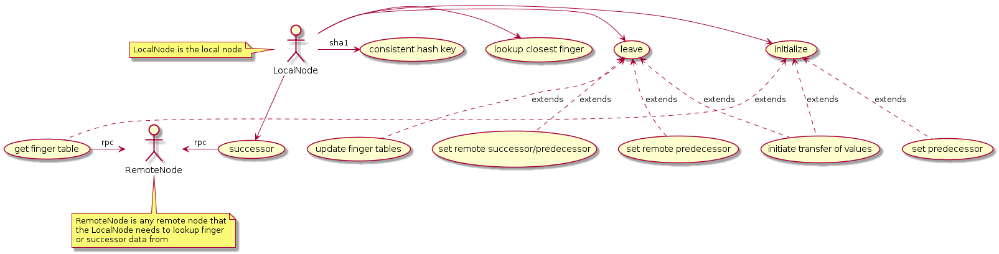
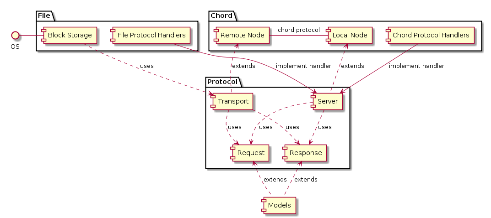
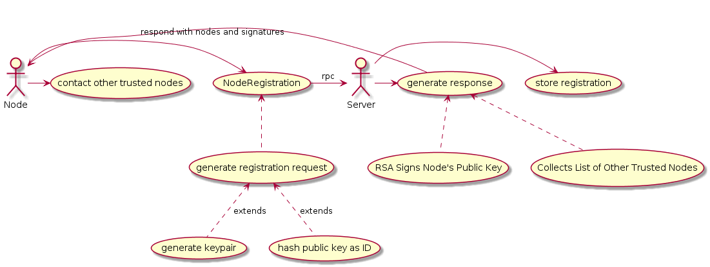
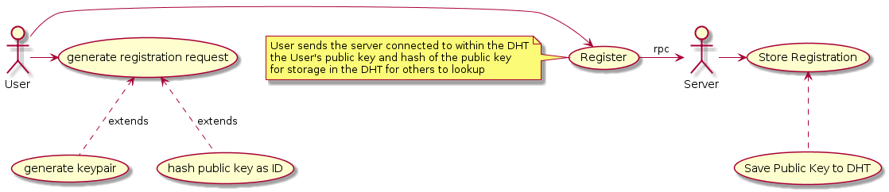
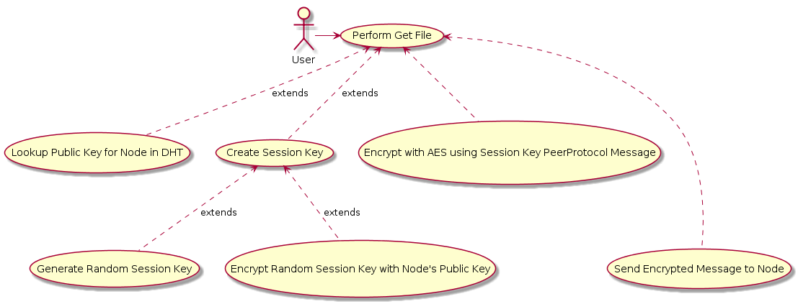
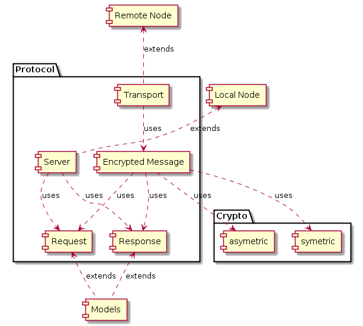
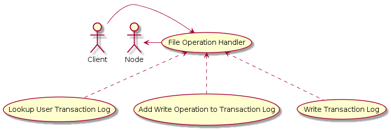
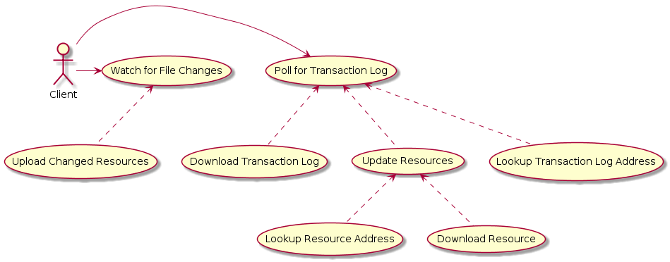

# PeerStore Design Document

## Introduction

Files are very important, and therefore must be stored in multiple locations.
What better way to protect files from a centralized failure than to put them
into a completely distributed system.  Moreover the performance benefits of
having documents sharded across a network, amoungst multiple nodes allows for
a better user experience.

### Purpose

PeerStore is a peer to peer file storage and sharing product.  As mentioned in
the [description of the project](../../README.md), the premise is to provide a
completely distributed secure peer to peer application for secure file storage
and sharing.  This application will in the end support the following features:

* File storage through a distributed hash table (DHT)
  * Implemented with the Chord algorithm
* Synchronization of files across client computers
* Authentication and Authorization of multiple users
* File Sharing across users
* Secure communications between peers in the DHT
* Strong Encryption of all files before they are inserted into DHT

### Scope

This design document will be broken into sections based completely on the four
primary milestones the project will be broken into, and thus will be designed
independently of the other milestones.  If a future milestone alters the design
in any way of a prior milestone, the design changes will be noted and explained
in that particular milestone's section of this document.

This document attempts to provide a journey, and not just the destination of
the project, and thus will be a living document.

#### Milestones

1. Develop DHT implementation and allow for storage of files
2. Ability to support multiple users and authentication
3. Synchronization of files between multiple clients
4. Encrypted file storage


### Definitions

- *Peer* - a node participating in the network
- *DHT* - Distributed Hash Table; a mechanism by which one can lookup which peer
in the PeerStore network is holding any given resource.
- *Chord* - [The algorithm](../chord_sigcomm.pdf) used to accomplish a DHT in
the PeerStore network
- *RPC* - Remote Procedure Call, a function or method that can be called from a
peer in the network.
- *Web of Trust* - A decentralized trust model where accumulation of keys happen
through the trust of interactions.

### Structure of Milestone Documentation

Each milestone top level section will start with a brief description of what
the objectives are for that particular milestone.  Then there will be a sub
section outlining the Use Cases, and Component Architecture.  A Discussion will
then be outlined as a sub-section describing in great detail the specifications
of the implementation developed.  This will then be followed by the dependencies
that were used in the implementation, and why those dependencies were needed for
the implementation.

The final milestone sub-section will be an explanation of how to run and test
the implementation, which will prove the milestone objectives were
accomplished.

## Milestone 1 - DHT implementation and file storage

A few key objectives in this milestone are as follows:

 * Client/Server peer to peer communications
 * OS I/O abstraction for reading/writing files to disk
 * Insertion of files in correct nodes for DHT
 * Look-ups in DHT for nodes containing files looked for

### Use Cases

There are a number of use cases that can be split into two independent modules
within the milestone.  These two are: the distributed hash table, used to find
relevant files amoungst the peers; the file sharing implementation.

#### File Sharing Use Cases

The file sharing protocol developed is based on these high level operations:
Post; Get; Delete.  These three methods basically enumerate the operations that
peer nodes will be able to perform against peer nodes via RPC calls.  The
implementation details of the protocol are outlined further in the Discussion
section.

Below is a high level use case diagram outlining the particulars of the
operations that a peer can make against remote peer servers.


As seen, the peer to peer file transmission only requires simple crud methods
for the server to implement, Post, Get and Delete.  These methods are
implemented as server handler functions, routed by the method in the request.

From the client perspective the application in addition to the three methods
needs to accept a directory of files which it will register with the client, so
that each of the files within the directory are posted to the peer servers.

#### DHT Routing Use Cases

The routing of which node to store any particular file falls on the DHT.  We are
implementing the Chord Protocol.  Below are use case diagrams that outline the
operations a Chord node has to accept and perform against other nodes.



In the bare basic sense, the Chord protocol requires each node to be able to
accept queries as to whom the successor of a given key would be based on their
information.  Each node has an understanding of who their successor is and each
node asks the next if they know the successor of the key given.

As realized this algorithm just described would be very inefficient.  To speed
up the look-ups the Chord algorithm articulates the need for a finger table,
which contains a subset of all of it's successor nodes.  In this case the
LocalNode will call successor locally to see if it's successor would be
the successor of the key given, and if not finds the node in it's finger table
who is closest, and asks that node if they are the successor.

When a node initializes or leaves, that node is responsible for fixing it's
peer's finger table, and predecessors, as well as the job of transferring all
the keys for which it responsible.


### Component Architectures

The components created in this milestone are outlined below:



As seen by the above diagram, there are three primary packages within this
design:  File, Chord, Protocol.

#### File Package

The file package is solely responsible for everything that has to do with
reading and writing of files to and from a file system.  The block storage
component performs the reading and writing for both the client (transport)
as well as the reading and writing of files for the server.

The file package also employs the protocol handlers for the server aspect of the
package.  By creating a custom handler type in the server package which we will
cover shortly, we can effectively hand off the protocol logic to the protocol
package, and the business logic of what to do with a file to the file package.

#### Protocol Package

Within the Protocol package we have two very distinct primary components, and
two secondary components.  As a primary component, we have a Server component.
This component handles all incoming connection processing, and connection
closing, as well as the method routing based on the type of request.

The server works off of a goroutine pool for connection handling, which is
user specified.  This is slightly different than how the http package handles
incoming connection requests, for example, because that package spawns a new
goroutine per request, which could easily overload the application in a DOS
type situation.

The Transport primary component within the Protocol package is the opposite of
a server, it initiates connections to backend servers, and sends requests, and
waits for responses from the server.

It is pretty clear by now what the two secondary packages are for, Request and
Response.  Request is the data structure by which a request is formatted, and
ultimately packaged for transmission over the connection.  The Response is the
structure for how the server will respond to any given request.

#### Chord Package

The Chord package handles everything that is required for the Chord algorithm.
Principally, this package manages the Local Node's finger table, predecessor,
and performs the search for successors of various keys.

This package, much like the File package, manages the business logic required
for the chord protocol to operate, including data structures that are embedded
in the request and response "Data" fields.

### Discussion (Specification)

At it's core, this is a service that will house copies of files.  That being the
case, it was very important that we have a sold mechanism in place to handling
file requests, be them upload or download or deletes.  To this end we created a
request processing thread pool, where you are able to specify the number of
workers and the amount of buffer those workers are allowed to have for queuing
messages.

The entire server design is really simple.  The server houses a map of request
methods to handlers, and when a particular request has a particular method, that
request is passed then to the handler it is mapped to.  A handler is merely
a function that takes in a request, and produces a response.  The server will
take that common response structure and wire serialize it.

The serialization we are using for both request's and responses is the go
built in serialization, called `gob` which is listed in the dependencies.  This
allowed us to have an efficient wire protocol that seamlessly will turn into go
specific data structures.

There is validation built into the request/response libraries, which include
valid options for methods, and response types.

Any given server in the cluster is able to accept file handling duties, and it
is up to the client to figure out the appropriate resource to push/pull files
from.

From the client perspective we have a `transport` package which has a
RoundTripper interface.  This works exactly the opposite of the server request
response scheme, in that the round tripper takes a request, dials the server,
transmits the request, and waits for the response before handing a response
back to the caller.

#### DHT Discussion

The chord protocol was chosen for this project.  When you start up a server,
you need to specify a peer to talk to initially.  When you specify a peer the
server will attempt to contact that peer, and self organize itself with the
chord ring that server is on.

Initiation of a server has the following actions: Contact the specified 
peer and ask who my "Successor" is.  In Chord each node has a successor, and
that successor has another successor.  This structure forms a cyclic graph
of nodes.  Based on the number of bits in the consistent hashing scheme the
graph at most can have m nodes, which is the number of bits in the hashing
scheme.

I will not be able to due the algorithm justice, and I urge you to read the
full specification in the resources section.  I will say, that the goal
is to provide a node to node mechanism for routing any given key using said
hashing mechanism to a particular peer in the cluster.  This works perfectly
for an even sharding distribution scheme, especially with a distributed file
scheme.

Here are the following operations that I have implemented:

* Initialization
* Stabilization
* Successor
* ClosestPrecedingNode
* FingerTable

The initialization task, basically entails the server starting up, and trying
to connect to the listed peer by getting the node's successor from the network.
If the node is unable to connect to the network, it will accept all requests,
as appropriate by the chord mechanism.  If there is already another node running
in the ring, the node will ask the peer what the node's successor is, and on
response, will attempt to SetPredecessor on the successor node, as well as set
the seeking node's finger table to show that as being it's immediate successor.

The stabilization task runs every so often, in our case in a stand along
goroutine from the main server entrypoint.  This task queries it's successor
to see if it is still the appropriate predecessor for the successor.  Based on
if the node is the rightful predecessor or not, it will re-set the successor's
predecessor field.  If it is not appropriate, it will take the new predecessor's
information and contact said predecessor, making itself the predecessor's predecessor.

This stabilization technique gives eventual location consistency for keys the
network is routing for.

#### Confessions

I must confess, I was unable to complete the chord implementation at the
due date of this milestone.  I have a strange bug where nodes are unable to
self organize quite right.  In that I mean the ring doesn't actually form
correctly, giving an uneven distribution of files to a few nodes in the
cluster.

I believe the problem lies in how I am handling the SetPredecessor functionality
because the nodes that are unable to join the ring properly seem to be stuck
fighting to join the ring, and the other nodes are not allowing them to insert
themselves into the ring.

#### The Client

At this time I have developed a rather simple client, that when given a directory
path, it will upload the contents of each file into the named peer, which was
retrieved using the Successor RPC call on the chord peer.  The chord peer will
route to the appropriate (the best it can, being somewhat broken at the moment)
node.  The client will then take this node information and speak directly to
the server, transmitting the file.

At this time there is a "getfile" functionality.  When the client is given a 
file name which is stored in the PeerStore, it will return and save that file
at the choosing of the user.

#### Sample Build

To build, you run `make release` or if you want a particular result, you can specify
such as `make linux`

#### Sample Run

Starting a PeerStore server:

```
./release/peerstore_server-latest-linux-amd64 -initialPeerAddr :3000 -addr :3001 -dataPath .peerstore/3001
```

I would suggest if you run more than one to use a different -dataPath for each
server running.  That will allow you to see the particular keys that are loaded
into that server.  If you are starting the first server the initial peer addr
is not that important.


Starting the peerstore client:

```
./release/peerstore_client-latest-linux-amd64 -peerAddr :3001 -localPath ~/peerstore/ -operation backup
```
This will take everything from `~/peerstore/` directory, recursively, and load
it into the server at peerAddr, which is port :3001 on localhost in this example

```
./release/peerstore_client-latest-linux-amd64 -filedest ~/test.txt.restored -peerAddr :3001 -filename ~/peerstore/test.txt -operation getfile
```

This command will restore the file from ~/peerstore/test.txt to the file called
~/test.txt.restored

#### Next Steps

It was clear after this adventure, more time and energy needs to be spent on
the peer to peer debugging and troubleshooting steps.  It is fairly obvious
there are a lot of moving parts, and though the algorithm is fairly straight
forward, there were a lot of gaps that need to be filled in an implementation.

### Dependencies

The dependencies used for this project are as follows, followed by a brief
explaination as to why, and how the help.

- [github.com/pkg/errors](github.com/pkg/errors)
    - This is not the standard golang error package, and is used because there
    are some wonderful features, such as errors.Wrap which will wrap the error
    you get from a given function with a string you pick.  This is extremely
    helpful for figuring out nested error conditions.
- [context](https://golang.org/pkg/context/)
    - This is part of the standard library, but is basically a mechanism by
    which you can pass unstructured context data along with function calls or
    structs.  This is used primarily to house number of workers, and channel
    buffer size in the server.go
- [encoding/gob](https://golang.org/pkg/encoding/gob/)
    - This is the encoding package we are using for converting structures into
    bytes.  Every request is serialized using the gob encoding, and deserialized
    on the server using the gob encoding.  Even in the business logic we are 
    serializing and deserializing the higher level request "Data" bytes with
    this libary
- [encoding/hex](https://golang.org/pkg/encoding/hex/)
    - We are using the encoding hex to make clean strings for the file names
    that we are storing on the various nodes in the Chord DHT.  The file name
    is used to create a "key" which is used by the Chord algorithm to find
    which node that file should be stored on.  When it get's stored on the node
    we write it to a file that is the hex representation of the key
- [net](https://golang.org/pkg/net/)
    - The net package is a standard library that we are using to create the 
    TCPListener for the server to accept network connections on. We also use
    this package to "Dial" the server with the net.Dial function.

For dependency management we are using the golang tool `dep` which has stores a
manifest in the repository "GoPkg.toml" which will keep track of all the non
standard library dependencies and version pin them to a working version.


### Resources

 - [The Chord Algorithm](../chord_sigcomm.pdf)
 - [Golang Documentation](https://golang.org/doc/)


## Milestone 2 - Multiple users, authentication, and transport encryption

A few key objectives in this milestone are as follows:

* Authentication of peers
* Authentication of users to access files
* Encryption of connections between peers and users


### Use Cases

There are three distinct use cases we can derive from the objectives above.
These three are: authentication of peer communications; authentication of users
who wish to access files across peers; and the encryption of the transport
between users and nodes, as well as nodes to nodes.


#### Authentication of Peers

In order to have authentication, a peer needs to inform other peers of it's
existence as well as some mechanism to prove in future interactions that the
node is who they say.  In order to achieve this feat we will be adding a node
"Registration" operation, which will take a public key, and the node's
identifier through an RPC call.

The node registration consists process will create a web of trust between the
nodes.  Given a node (N1) wishing to register with another node (N2), N1 will
package up it's own public key, as well as it's identifier and contact address.
At this point N2 will generate a list of other nodes (Nx) which N2 already knows
about.  N2 will perform a SHA256 on N1's Public Key provided in the registration
request.  N2 will then respond to N1 with the list (Nx) and the signature of
the public key of N1 back to N1.

At this point N1 will be required to contact all of the nodes Nx and inform them
of N1's wishes to be trusted through a NodeTrust method.  For each Nx, N1 will
present Nx with the signature of the N1's public key, and N1's public key.

At this point Nx will verify N2's signature on N1's public key, and accept N1 as
a trusted node.  Nx will then respond to N1 with a list of nodes that Nx knows of
(Ny) as well as a signature of N1's public key.  N1 upon recieving the response
will contact all nodes in Ny for NodeTrust.

This way all of the nodes in the cluster will add registering nodes to a trusted
nodes list, and maintain the trust with new nodes that are entering.

Below is the high level use case diagram outlining the particulars of the peer
registration process by which peers store their public key's within the each node.



You may also note that all peer to peer communications, other than registration,
have now been updated to include a "from" id and a "signature" field in the
message header.  This will allow peers to know from whom the message is coming,
as well as an RSA signature the peer will be able to validate before processing
of the request.

#### Authentication of Users

In order to have authentication, a user needs to inform the peers in the DHT of
it's existence, as well as a mechanism to prove in future interaction that the
user is who they say.  As we can reuse the node to node registration quite
easily, and merely apply it to the Users of the DHT we are going to follow the
same conventions for authentication of users.

Below is the high level use case diagram outlining the particulars of the user
registration process, by which users can store their public Key's within the
DHT:



Since we are following a similar registration convention that new nodes
use for registration, we are able to benefit from re-use.  We are storing user's
public keys in the DHT.

We are also re-using the same "from" id and "signature" field in the message
header for all requests, in order to identify and authenticate users.

In order to preserve authentication to users we are also adding a "header"
section to the stored files, which will include the user's public key identifier
which is used to validate ownership of the file to the user.

When a user request is made to take action upon a file, the user identifier in
the action request is compared to the file "header" to make sure the user
identifier matches the request.  Moreover the signature of the request is
validated against the public key which is stored in the DHT for that given
user identifier.

If the user identifier matches, and the signature is validated by the public key
which is stored in the DHT, then the user is thereby authorized to take action
on that file.

With the small changes to the files stored in the data directory in each node
within the DHT we are able to confirm ownership of a particular file at 
request time, allowing the node to accept or deny the operation.


#### Encryption of Communications

Since we are already distributing and using key pairs for validation of
ownership and authentication of messages, we will continue to use them for
encryption of session keys for session communications.

For encryption of communications we will be using AES in CBC mode.  Every
message that gets sent from either a peer or a user will be "wrapped"
in a new encrypted message type which will consist of the following attributes:

1. Session Key
    * this will be the encrypted (with public key cryptography) session key to
    unlock the session stream
2. Initialization Vector
    * this will be the AES initialization vector used in CBC mode.
3. Ciphertext
    * this will be the encrypted version of the peerstore protocol message
3. Signature
    * this is the RSA signature of a hash of the payload

Below is the high level use case diagram outlining the particulars of the
transport encryption process:




### Component Architectures

The components created in this milestone are outlined below:



As seen by the above diagram, there are three primary packages within this
design:  Crypto, File, Protocol.

#### Changes to File Package

The file package was defined in Milestone 1 and has been slightly altered.  It
has been altered to allow for a new "header field" within the file.  The first
twenty bytes of all files stored in DHT nodes is now the identifier of the user.

We will use this to validate authenticity of users for the given file they are
attempting to access.  All other functionality of the file package is to remain
the same.


#### Protocol Package

The protocol package was defined in Milestone 1 and has been slightly altered.
It has been changed to include an "Encrypted Transport" message type which
contains a "Hash" field, "Session Key" field, a "Initialization Vector" field,
as well as an "Ciphertext" field.  This message type is meant to encapsulate the
existing protocol base message type.

The protocol package now requires the "Crypto" package in order to perform
encryption/decryption, signature validation and session key decryption.

The new server flow is now as follows:
1. Using public key crypto, decrypt the Session Key with server's private key
2. Using the Initialization Vector, and decrypted Session Key, decrypt Ciphertext
3. Validate the payload of the Plaintext by performing an RSA signature validation
on a hash of decrypted Ciphertext and comparing it to the signature in the request
4. Attempt to decode the peer protocol message and process as plaintext

With this small processing pipeline change, we are able to secure the existing
message protocol with minimal changes, using the web of trust the DHT has built.

#### Sample Build

To build, you run `make release` or if you want a particular result, you can specify
such as `make linux`

#### Running Notes

Starting a single peerstore server with no peers:

```
./release/peerstore_server-latest-linux-amd64 -initialPeerAddr :3000 -addr :3001 -dataPath .peerstore/3001 -logtostderr
```

Starting another peerstore server with a peer:
```
./release/peerstore_server-latest-linux-amd64 -initialPeerAddr :3001 -addr :3002 -dataPath .peerstore/3002 -logtostderr -initialPeerKeyFile .peerstore/3001/publickey.pem
```

Server Notes:

Starting the peerstore server the first time will generate a keypair on startup
during the registration process.  If there is already a keypair in the -dataPath
specified directory that keypair will be used.  These keypairs are how the
session key is decrypted in order to accept any communications as well as how
messages are signed by the peer.

Also note there is a new flag, `initialPeerKeyFile` which is the public key file
of the peer's keypair.  The peers work in a web of trust, so, on start up, the
node will obviously trust itself.  Given a peer public key file, the peer will
also default trust that peer.

Peers have a registration process, so when the second peer registers to the first
peer the first peer will sign the public key of the second peer and send that
as well as a list of all known peers back in the response.

It is the registering peer's job to connect to each of the other nodes and perform
a node trust process.  This process involves sending a request to the peer, which
contains the signature from the original registrant node.

This is how all of the nodes can be authenticated with each other in a web of trust.


Starting the peerstore client:

Performing a backup of a directory:
```
./release/peerstore_client-latest-linux-amd64 -peerAddr :3001 -localPath ~/peerstore/ -operation backup -peerKeyFile .peerstore/3001/publickey.pem  -selfKeyFile .peerstore/user1.pem
```

Note that we added two flags to the client.  First flag is `peerKeyFile` and this
is the public key of a node in the cluster.  This is required for securing the
communications between the "user" and the node.  The second flag is `selfKeyFile`
which is this particular user's public and private key file in PEM format.

This key file *IS* the identity of the user.  If you perform actions with one PEM
file and try to perform getfile actions with a different PEM file, you will not
be able to, as the authentication of users is tied to the RSA keys.

To test it out, perform the following:

```
# backup a directory
./release/peerstore_client-latest-linux-amd64 -peerAddr :3001 -localPath ~/peerstore/ -operation backup -peerKeyFile .peerstore/3001/publickey.pem  -selfKeyFile .peerstore/user1.pem
# try to get a file from the directory
./release/peerstore_client-latest-linux-amd64 -filedest ~/test.txt.restored -peerAddr :3001 -filename ~/peerstore/test.txt -operation getfile -peerKeyFile .peerstore/3001/publickey.pem -selfKeyFile .peerstore/user1.pem
# now try to get a file with another "user's" key file
./release/peerstore_client-latest-linux-amd64 -filedest ~/test.txt.restored -peerAddr :3001 -filename ~/peerstore/test.txt -operation getfile -peerKeyFile .peerstore/3001/publickey.pem -selfKeyFile .peerstore/user2.pem

```

You will notice that if the `selfKeyFile` already exists, the client will use
the existing key file, if it doesn't exist, it will be created for you.


### Dependencies

The dependencies used for this project are as follows, followed by a brief
explanation as to why, and how the help.

- [crypto/rsa/](https://golang.org/pkg/crypto/rsa/)
    - This is the golang RSA crypto package.  We are using RSA for it's
    public/private key cryptographic operations, including encryption,
    decryption, and digital signatures as well as validation of signatures.
    - We are also using this package to generate our key pairs
- [crypto/aes](https://golang.org/pkg/crypto/aes/)
    - This is the golang AES crypto package.  We are using AES for it's
    strong encryption and decryption capabililties for transport security.

For dependency management we are using the golang tool `dep` which has stores a
manifest in the repository "GoPkg.toml" which will keep track of all the non
standard library dependencies and version pin them to a working version.


### Resources

 - [Golang Documentation](https://golang.org/doc/)


## Milestone 3 - Across Client File Synchronization


The key objective of this milestone is to add support for cross client file
synchronization.  In order to support this feature the following implementation
items need to be achieved:

1. A user based resource transaction log, capturing:
  * Any resource additions/deletions/changes to a resource belonging to a user
2. Converting the Client into a daemon:
  * Which polls on a periodic interval the remote transaction log
  * Compares the resource transaction log with the current local state
  * Updates the local file state based on the transaction changes

The remote transaction log will be the source of truth for all changes to the
resources which are stored in the DHT.  Said transaction log will be addressable
within the DHT as well, allowing any node/client the ability to access the
transactions that are performed.


### Use Cases

There are two distinct use cases that need to be addressed within the system:

1. Nodes must be able to find and manipulate the transaction log
2. Clients must be able to find the transaction log and pull required resources

#### Transaction Log Manipulation

For nodes to find the transaction log, the DHT addressing scheme will be similar
to how nodes are able to find the public key for clients.  The transaction log
address will be a concatination of the user's public key, and the word
`-transaction-log`, which will be hashed using the SHA1 hashing function.  With
this consistent naming convention the nodes will be able to deterministically
compute the address of the transaction log for a user, which will allow them to
perform a lookup in the DHT for the transaction log resource.  This transaction
log resource will have the same operations as every other resource within the
system, allowing any node to update the transaction log.  Below is a use case
diagram describing the scheme:




#### Client Transaction Log Implementation

A client will poll on a determined interval the transaction log for the user.
The client will deterministically compute the address of the transaction log the
same way a node will, in order to figure out the node which houses the
transaction log for that user.

A client will have a local transaction log that will mirror the remote
transaction log.  Initially the local transaction log will be empty, until that
transaction log is polled from the server.  At this point the client will
attempt to pull the current state of each resource defined within the remote
transaction log.  Below is a use case diagram describing this scheme:




### Component Architectures

#### File Package

The file package will be slightly altered in order to support this change.
Within each file handler operation, the file package will need to lookup the
transaction log, and alter the transaction log with the operation that was
performed.  The transaction log will consist of a `gob` encoded array which
consists of the following elements:

* Operation
* Resource Name
* Resource ID

The operation will say what operation happened (UPDATE or DELETE), the resource
name will be the string representation of the resource which is the filename and
path of said resource, and resource ID is the identifier in the DHT of the
resource in order to pull the resource.

#### Sample Build

To build, you run `make release` or if you want a particular result, you can specify
such as `make linux`

#### Running Notes

Starting a single peerstore server with no peers:

There is no change in how to start the server from Milestone 2.  Please refer to
the Milestone 2 documentation in order to start the server.


Starting the peerstore client:

There is significant changes to the client in the Milestone, primarily due to
the watching of file changes on the filesystem, and the polling required to keep
the client up to date.

The client now runs as a daemon when the `sync` operation is given:

```
# backup and synchronize a directory
./release/peerstore_client-latest-linux-amd64 -peerAddr :3001 -localPath ~/peerstore/ -operation sync -peerKeyFile .peerstore/3001/publickey.pem  -selfKeyFile .peerstore/user1.pem
```

When this command is run the client will run in a daemon mode.  On startup the
client will poll for any transaction that relate to any files within the
`localPath`, and if there are resources within this localPath the client will
pull those resources from the DHT and place them in the `localPath`.

The client now uses a file system watcher to watch for any file changes within
`localPath` and will send the file changes to the DHT.

In order to run, I suggest running the above command in one terminal window, and
then changing the files on the filesystem in another command window.

### Dependencies

The dependencies used for this project are as follows, followed by a brief
explanation as to why, and how the help.

- [go-fsnotify/fsnotify](https://github.com/fsnotify/fsnotify)
    - This package is used by the client to watch for any file system changes
    within the localPath in order to push changes to the DHT

For dependency management we are using the golang tool `dep` which has stores a
manifest in the repository "GoPkg.toml" which will keep track of all the non
standard library dependencies and version pin them to a working version.


### Resources

 - [Golang Documentation](https://golang.org/doc/)


